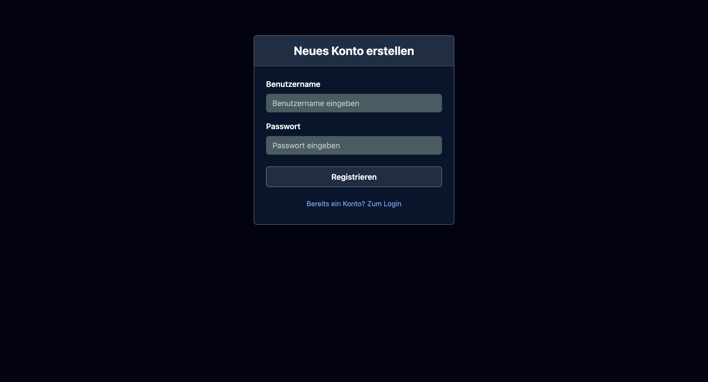
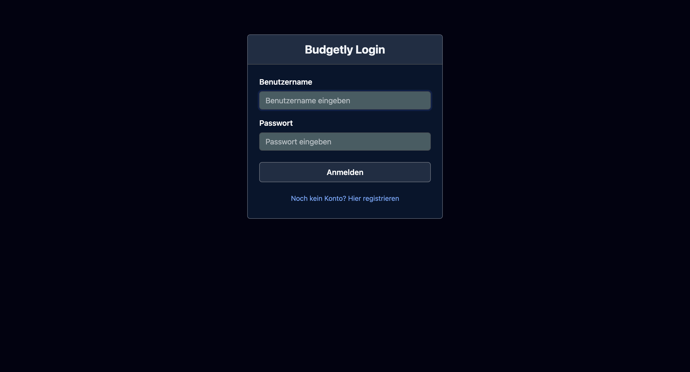
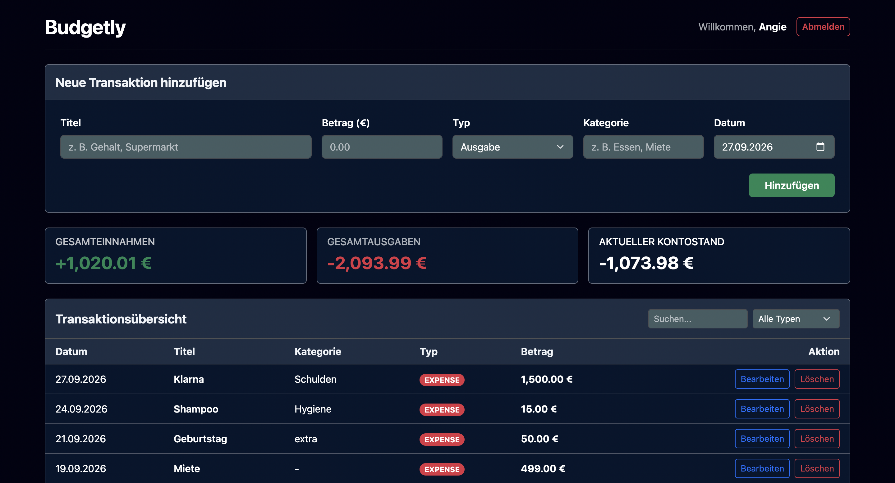
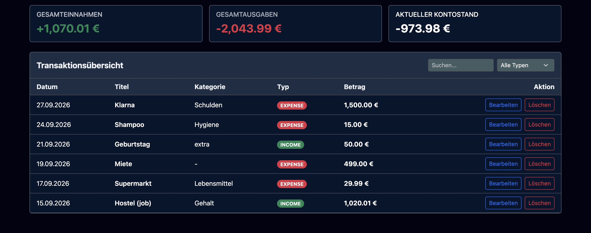
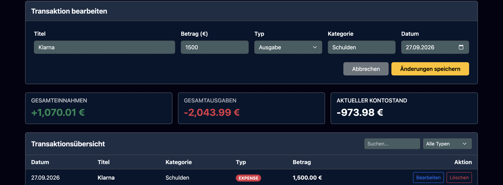

# Budgetly – Persönlicher Finanz- & Ausgaben-Tracker

Budgetly ist eine moderne Fullstack Webanwendung zur Erfassung, Verwaltung und Auswertung persönlicher Einnahmen und Ausgaben. Die Anwendung ermöglicht eine rollen und nutzerbasierte Datentrennung mit vollständiger CRUD-Funktionalität, interaktiven Auswertungen und einem responsiven Design.

---

## Live-Demo & Deployment

Die Anwendung ist vollständig in der Cloud bereitgestellt:

* **Frontend (Vercel):** [https://budgetly-blond.vercel.app](https://budgetly-blond.vercel.app)
* **Backend API (Render):** [https://budgetly-011m.onrender.com](https://budgetly-011m.onrender.com)
* **Datenbank:** MongoDB Atlas (Cloud Cluster)

---

## Screenshots & Benutzeroberfläche

## 1. Authentifizierung (Registrierung & Login)



## 2. Hauptansicht (Formular und Transaktionsübersicht)



## 3. Transaktion ändern

---

## Verwendete Technologien

* **Frontend:**
  * **Angular (v18+)** mit Standalone Components und TypeScript
  * **Bootstrap 5** für das responsive Grid-System und UI-Elemente
  * **RxJS** für asynchrone Datenströme und reaktives State-Handling
* **Backend:**
  * **Node.js** mit **Express.js** (REST API)
  * **CORS** und **dotenv** für Umgebungsvariablen
* **Datenbank:**
  * **MongoDB Atlas** mit **Mongoose ODM**
* **Deployment & CI/CD:**
  * **Vercel** (Frontend Continuous Deployment via Git)
  * **Render** (Backend Web Service)

---

## Features & Umsetzung der Anforderungen

### 1. Vollständiges CRUD (Create, Read, Update, Delete)
* **Create (Erstellen):** Über die Komponente `TransactionForm` werden neue Ausgaben oder Einnahmen über einen HTTP-`POST`-Request angelegt.
* **Read (Anzeigen):** Die Komponente `TransactionList` lädt alle Transaktionen via HTTP-`GET` und zeigt sie tabellarisch an.
* **Update (Aktualisieren):** Durch Klick auf Bearbeiten in der Liste werden die Formulardaten über `@Input()` befüllt und per HTTP-`PUT` an `/api/transactions/:id` überschrieben.
* **Delete (Löschen):** Einträge lassen sich per HTTP-`DELETE` entfernen; die Tabelle aktualisiert sich im Anschluss automatisch.

### 2. Benutzer-Authentifizierung & Datentrennung
* Registrierung und Login mit Passwort-Validierung.
* Token- und ID-Verwaltung über den `AuthService` im Browser (`localStorage`).
* **Strikte Nutzertrennung:** Jeder HTTP-Request an die Transaktions-API übermittelt die `user-id` im Request-Header. Das Backend stellt sicher, dass Nutzerinnen und Nutzer ausschließlich Zugriff auf ihre eigenen Daten haben.

### 3. Interaktive Auswertung & Filter
* Dynamische Berechnung von **Gesamteinnahmen**, **Gesamtausgaben** und dem **aktuellen Kontostand (Saldo)** in Echtzeit.
* Live-Filterung nach Typ (`Einnahme`, `Ausgabe`, `Alle`) und eine Textsuche nach Titel oder Kategorie.
---

## Lokale Installation & Ausführung
* Repository klonen:
```bash
git clone [https://github.com/Angie-0-4/Budgetly.git](https://github.com/Angie-0-4/Budgetly.git)
cd Budgetly

* Backend starten:
cd backend
npm install
npm run dev

* Frontend starten:
cd ../frontend
npm install
ng serve

### Voraussetzungen
* [Node.js](https://nodejs.org/) (Version 18 oder höher)
* [Angular CLI](https://angular.dev/) (`npm install -g @angular/cli`)
* [Git](https://git-scm.com/)

## KI 
* Gemini: Geholfen beim Debbuging, Readme.md und Backend
---

